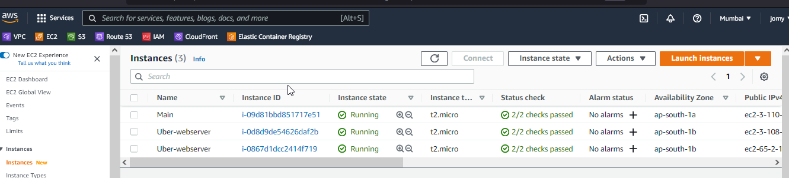

# Ec2-creation-and-manage-using-Ansible-playbook

[](https://travis-ci.org/joemccann/dillinger)

---

## Description 

Simple ansible playbook for creating a amazon Ec2 with all required resoruces.  

----
## Pre-Requests
- Need to install ansible2 on Master node to run
- AWS CLI Programmatic user
- python3
- python3-pip
- boto3
- awscli with latest version
-----

### Ansible installation 

```sh
amazon-linux-extras install epel -y
amazon-linux-extras install ansible2 -y
yum install python3
yum install python3-pip
pip install awscli --upgrade
ansible-galaxy connection install amazon.aws -y
pip3 install boto3
pip3 install botocore
```

### Behind the code : hosts file
```sh
~]$ cat hosts
localhost ansible_connection=local ansible_python_interpreter=/usr/bin/python3
```
> You need to verify the localhost ansible is now able to communicate with python3. For verify

```sh
$ ansible -i hosts localhost -m setup | grep "ansible_python_version"
        "ansible_python_version": "3.7.10"
 ```
### Behind the code : .boto file
```sh
[Credentials]
aws_access_key_id = AKIASH75KESC43FJ
aws_secret_access_key = aPXYPZjpC4Vlm9yXASB536hH/kE/Y1Lm8
```
### Behind the code : main.yml
```sh
---

- name: "AWS EC2 creation using Ansible-playbook"
  hosts: localhost
  vars:
    project: "Uber"
    region: "ap-south-1"
    instance_type: "t2.micro"
    instance_ami: "ami-0e0ff68cb8e9a188a"
  tasks:

    - name: "AWS Infra - Creating Ssh-Key Pair"                                          ### For keypair creation
      amazon.aws.ec2_key:
        name: "{{project}}"
        state: present
        tags:
          Name: "{{ project }}"
          project: "{{ project }}"

      register: Check_keypair_status


    - name: " AWS Infra - Copying the private Key Of {{ project }} keypair to local PC"
      when: Check_keypair_status.changed == true
      copy:
        content: "{{ Check_keypair_status.key.private_key}}"
        dest: "{{ project }}.pem"                                                         ### This will create the keypair pem file and download to our local PC
        mode: 0400

    - name:  " AWS Infra - Creating webserver security group"                             ### Creating the secuirty group with 80 and 443
      amazon.aws.ec2_group:
        name: "{{ project }}-webserver"
        description: "allows 80,443 from all"
        region: "{{ region }}"

        rules:
          - proto: tcp
            from_port: 80
            to_port: 80
            cidr_ip: 0.0.0.0/0

          - proto: tcp
            from_port: 443
            to_port: 443
            cidr_ip: 0.0.0.0/0
        tags:
          Name: "{{ project }}-webserver"
          project: "{{ project }}"
      register: webserver

    - name:  " AWS Infra - Creating another remote security group"                       ### Creating the secuirty group with 20
      ec2_group:
        name: "{{ project }}-remote"
        description: "allows 22 from all"
        region: "{{ region }}"

        rules:
          - proto: tcp
            from_port: 22
            to_port: 22
            cidr_ip: 0.0.0.0/0

        tags:
          Name: "{{ project }}-remote-sg"
          project: "{{ project }}"
      register: remote


    - name:  " AWS Infra - Creating Ec2 Instance For Webserver"                         ### Creating the EC2 Instance
      ec2:
        region: "{{ region }}"
        key_name: "{{ Check_keypair_status.key.name}}"
        instance_type: "{{ instance_type }}"
        image: "{{ instance_ami }}"
        wait: yes
        group_id:
          - "{{ webserver.group_id }}"
          - "{{ remote.group_id }}"
        instance_tags:
          Name: "{{ project }}-webserver"
          project: "{{ project }}"
        count_tag:
          Name: "{{ project }}-webserver"
        exact_count: 2                                           ### This will limit the EC2 creation from re-running the playbook. Other wise ansible will recreate the EC2
 ```


### Sample output while running the playbook

```
 ~]$ ansible-playbook -i hosts main.yml

PLAY [AWS EC2 creation using Ansible-playbook] *************************************************************************************************************************

TASK [Gathering Facts] *************************************************************************************************************************************************
ok: [localhost]

TASK [AWS Infra - Creating Ssh-Key Pair] *******************************************************************************************************************************
changed: [localhost]

TASK [AWS Infra - Copying the private Key Of Uber keypair to local PC] *************************************************************************************************
changed: [localhost]

TASK [AWS Infra - Creating webserver security group] *******************************************************************************************************************
changed: [localhost]

TASK [AWS Infra - Creating another remote security group] **************************************************************************************************************
changed: [localhost]

TASK [AWS Infra - Creating Ec2 Instance For Webserver] *****************************************************************************************************************
changed: [localhost]

PLAY RECAP *************************************************************************************************************************************************************

```
> I have tweaked the exact_count: 2 to 3 and it will create one more. 
```
 ~]$ ansible-playbook -i hosts main.yml

PLAY [AWS EC2 creation using Ansible-playbook] *************************************************************************************************************************

TASK [Gathering Facts] *************************************************************************************************************************************************
ok: [localhost]

TASK [AWS Infra - Creating Ssh-Key Pair] *******************************************************************************************************************************
ok: [localhost]

TASK [AWS Infra - Copying the private Key Of Uber keypair to local PC] *************************************************************************************************
skipping: [localhost]

TASK [AWS Infra - Creating webserver security group] *******************************************************************************************************************
ok: [localhost]

TASK [AWS Infra - Creating another remote security group] **************************************************************************************************************
ok: [localhost]

TASK [AWS Infra - Creating Ec2 Instance For Webserver] *****************************************************************************************************************
changed: [localhost]

PLAY RECAP *************************************************************************************************************************************************************
localhost                  : ok=5    changed=1    unreachable=0    failed=0    skipped=1    rescued=0    ignored=0
```
```
<center>  </img></center>

<center> </img></center>

 ## Conclusion

Created the EC2 secuirty group keypair tags using Ansible


#### ⚙️ Connect with Me

<p align="center">
<a href="mailto:jomyambattil@gmail.com"></a>
<a href="https://www.linkedin.com/in/jomygeorge11"></a> 
<a href="https://www.instagram.com/therealjomy"></a><br />
